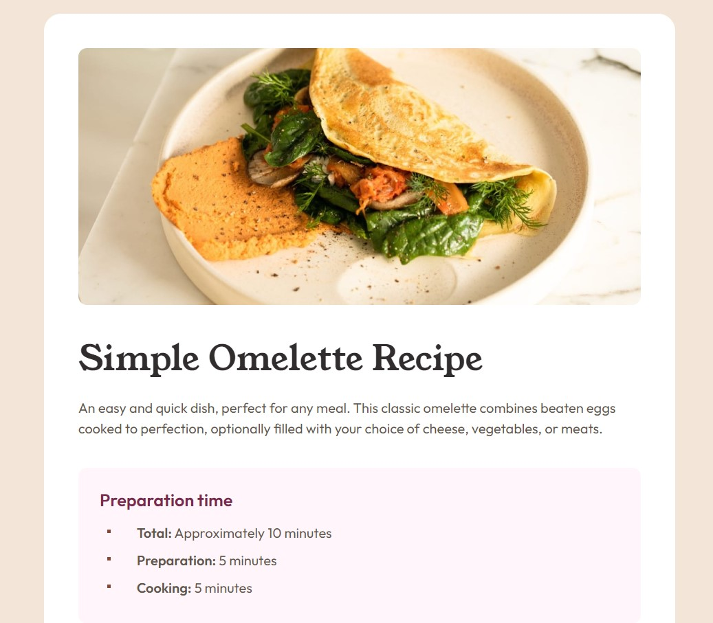

# Frontend Mentor - Recipe page solution

This is a solution to the [Recipe page challenge on Frontend Mentor](https://www.frontendmentor.io/challenges/recipe-page-KiTsR8QQKm). Frontend Mentor challenges help you improve your coding skills by building realistic projects. 

## Table of contents

- [Overview](#overview)
  - [Screenshot](#screenshot)
  - [Links](#links)
- [My process](#my-process)
  - [Built with](#built-with)
  - [Useful resources](#useful-resources)
- [Author](#author)

## Overview

### Screenshot



### Links

- Solution URL: [GitHub](https://github.com/Shcracoziabra/recipe-page)
- Live Site URL: [Netlify](https://shcraco-recipe-page.netlify.app)

## My process

This challenge provided an experience of building plain responsive page. I tried to use semantic tags in HTML layout to help users better understand its content. Also I followed the design details to reflect them all with CSS.

### Built with

- Semantic HTML5 markup
- CSS custom properties
- Flexbox
- CSS Grid

### What I learned

With this challenge I gained an experience of adding custom fonts to my website. 
Learned how to use pseudoelements `::before` and `::marker` to make the custom marker of a list item.

```css
ul li {
    position: relative;
    padding-left: 16px;
    font-size: 16px;
    list-style-type: none
}

ul li::before {
    position: absolute;
    top: 50%;
    transform: translateY(-100%);
    left: -18px;
    content: "";
    width: 4px;
    height: 4px;
    background-color: var(--nutmeg)
}

ol li::marker{
    color:  var(--nutmeg);
    font-weight: 700; 
}
```

### Useful resources

- [CSS ::marker](https://web.dev/articles/css-marker-pseudo-element) - This is an article where you can find all about custom list markers.
- [@font-face rule](https://developer.mozilla.org/en-US/docs/Web/CSS/@font-face) - MDN web docs about using @font-face.

## Author

- GitHub - [Tetiana B.](https://github.com/Shcracoziabra)
- Frontend Mentor - [@Shcracoziabra](https://www.frontendmentor.io/profile/Shcracoziabra)
